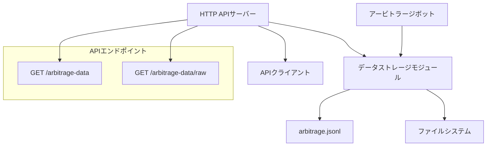

# 設計書

## 概要

アービトラージデータAPIシステムは、以下の2つの主要コンポーネントで構成されます：

1. **データストレージモジュール** - 裁定取引機会を保存するためのJSONLファイル操作を処理
2. **HTTP APIサーバー** - 保存されたデータを取得するためのRESTエンドポイントを提供

このシステムは、データ永続化機能を追加することで既存のアービトラージボットと統合し、ボットプロセスと並行して軽量なHTTPサーバーを実行します。

## アーキテクチャ



### コンポーネント間の相互作用フロー

1. **データ収集**: ボットが裁定取引機会を検出 → データストレージモジュールがJSONLに追記
2. **データ取得**: APIクライアントがデータをリクエスト → HTTPサーバーがJSONLを読み込み → フォーマットされたレスポンスを返す

## コンポーネントとインターフェース

### 1. データストレージモジュール

**目的**: アトミックな書き込みとエラーハンドリングを備えたJSONLファイル操作を処理

**インターフェース**:

```typescript
interface ArbitrageRecord {
  pair: string;
  timestamp: string; // ISO 8601 JST
}

interface DataStorageService {
  appendRecord(record: ArbitrageRecord): Promise<void>;
  readAllRecords(): Promise<ArbitrageRecord[]>;
  readRawContent(): Promise<string>;
  ensureDataDirectory(): Promise<void>;
}
```

**実装詳細**:

- 非同期ファイル操作にNode.js `fs.promises`を使用
- 一時ファイルとリネーム操作を使用したアトミックな書き込みを実装
- ファイルロックまたはキューイング機構で同時アクセスを処理
- 環境変数`DATA_DIR`による設定可能なデータディレクトリ（デフォルト: `./data/`）

### 2. HTTP APIサーバー

**目的**: データ取得のための軽量なREST APIサーバー

**インターフェース**:

```typescript
interface APIServer {
  start(port: number): Promise<void>;
  stop(): Promise<void>;
}
```

**エンドポイント**:

- `GET /arbitrage-data` - すべての記録をJSON配列として返す
- `GET /health` - ヘルスチェックエンドポイント

**実装詳細**:

- 依存関係を最小化するためNode.jsネイティブ`http`モジュールを使用
- 外部フレームワークなしで基本的なルーティングを実装
- クロスオリジンリクエスト用の適切なCORSヘッダーを設定
- リクエストログとエラーハンドリングミドルウェアを含む

### 3. ボット統合モジュール

**目的**: 既存のボットロジックとデータストレージを統合

**インターフェース**:

```typescript
interface BotIntegration {
  recordArbitrageOpportunity(pair: string): Promise<void>;
  initializeDataStorage(): Promise<void>;
}
```

**統合ポイント**:

- `bot.ts`の`execute()`関数を修正して機会を記録
- `initExchanges()`にデータストレージ初期化を追加
- ボットのパフォーマンスを維持するためノンブロッキング操作を保証

## データモデル

### ArbitrageRecord

```typescript
interface ArbitrageRecord {
  pair: string; // 例: "SOL/USDT", "DOGE/USDC"
  timestamp: string; // ISO 8601 JST形式: "2025-07-16T15:30:00+09:00"
}
```

### JSONLファイル形式

各行に単一のJSONオブジェクトを含む:

```
{"pair": "SOL/USDT", "timestamp": "2025-07-16T15:30:00+09:00"}
{"pair": "DOGE/USDC", "timestamp": "2025-07-16T15:30:30+09:00"}
{"pair": "SOL/USDT", "timestamp": "2025-07-16T15:31:00+09:00"}
```

### APIレスポンス形式

**GET /arbitrage-data**:

```json
[
  { "pair": "SOL/USDT", "timestamp": "2025-07-16T15:30:00+09:00" },
  { "pair": "DOGE/USDC", "timestamp": "2025-07-16T15:30:30+09:00" }
]
```

**GET /arbitrage-data/raw**:

```
{"pair": "SOL/USDT", "timestamp": "2025-07-16T15:30:00+09:00"}
{"pair": "DOGE/USDC", "timestamp": "2025-07-16T15:30:30+09:00"}
```

## エラーハンドリング

### ファイル操作

- **ファイルが見つからない**: 自動的にファイルを作成し、空の結果を返す
- **権限エラー**: エラーをログに記録し、汎用メッセージでHTTP 500を返す
- **ディスク容量不足**: エラーをログに記録し、クリーンアップを試行し、HTTP 500を返す
- **不正なJSON行**: 無効な行をスキップし、警告をログに記録し、処理を続行

### HTTPサーバー

- **無効なルート**: JSON エラーレスポンスでHTTP 404を返す
- **サーバーエラー**: 汎用エラーメッセージでHTTP 500を返す
- **リクエストタイムアウト**: ファイル操作に30秒のタイムアウトを実装

### エラーレスポンス形式

```json
{
  "error": "Internal server error",
  "timestamp": "2025-07-16T15:30:00.000Z"
}
```

## テスト戦略

### ユニットテスト

- **データストレージモジュール**: ファイル操作、エラーハンドリング、アトミック書き込みをテスト
- **HTTPサーバー**: エンドポイントレスポンス、エラーケース、コンテンツタイプをテスト
- **ボット統合**: 機会記録、初期化をテスト

### 統合テスト

- **エンドツーエンドフロー**: ボット検出 → データストレージ → API取得
- **同時アクセス**: 複数の書き込みと読み込みを同時実行
- **ファイルシステムエッジケース**: 存在しないディレクトリ、権限問題

### テストデータ

- 様々なシナリオのサンプルJSONLファイル（空、不正な行、大きなファイル）
- 一貫したテストのためのモック裁定取引機会
- 大きなデータセットでのパフォーマンステスト

## 設定

### 環境変数

```bash
# データストレージ設定
DATA_DIR=./data                    # データディレクトリパス
JSONL_FILENAME=arbitrage.jsonl     # JSONLファイル名

# APIサーバー設定
API_PORT=3000                      # HTTPサーバーポート
API_HOST=localhost                 # サーバーホストバインディング

# ログ設定
LOG_LEVEL=info                     # ログの詳細レベル
```

### デフォルト設定

- データディレクトリ: `./data/`
- JSONLファイル名: `arbitrage.jsonl`
- APIポート: `3000`
- ホストバインディング: `localhost`（セキュリティ考慮）

## セキュリティ考慮事項

### 現在の実装

- **ローカルバインディング**: デフォルトでlocalhostのみにサーバーをバインド
- **認証なし**: ローカル/プライベートネットワークデプロイメントに適している
- **入力検証**: JSON構造と必須フィールドを検証
- **パストラバーサル保護**: ファイルアクセスをデータディレクトリのみに制限

### 将来の拡張

- **IPホワイトリスト**: 設定可能な許可IPアドレス
- **APIキー認証**: シンプルなベアラートークン認証
- **レート制限**: API乱用を防止
- **HTTPS対応**: 本番デプロイメント用のTLS暗号化

## パフォーマンス考慮事項

### ファイル操作

- **ストリーミング読み込み**: 大きなJSONLファイルにreadlineインターフェースを使用
- **追記専用書き込み**: 継続的なデータ収集に効率的
- **メモリ管理**: APIレスポンスでファイル全体をメモリに読み込むことを避ける

### HTTPサーバー

- **コネクションプーリング**: パフォーマンス向上のため接続を再利用
- **レスポンスキャッシュ**: TTL付きで解析済みJSONLデータをキャッシュ
- **圧縮**: 大きなレスポンスにGzip圧縮

### スケーラビリティ

- **ファイルローテーション**: 大きなデータセットに日次/週次ファイルローテーションを実装
- **データベース移行パス**: データベースストレージへの将来の移行を可能にする設計
- **水平スケーリング**: 複数のAPIインスタンスが同じJSONLファイルを読み込み可能
